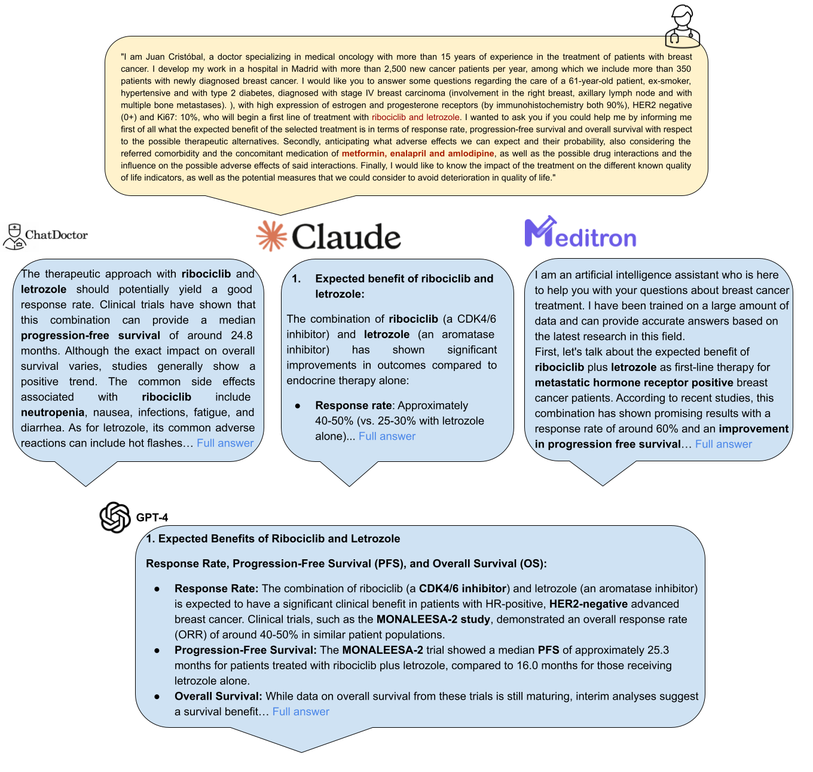
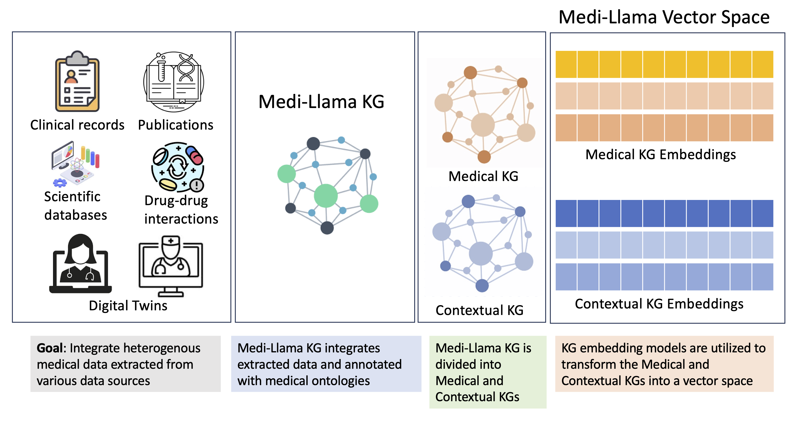

# Medi-LlaMA

Medi-LlaMA is a Hybrid AI system integrating LlaMA, knowledge graphs, and symbolic reasoning and learning. Medi-LlaMA aims to identify individual conditions predisposing patients to adverse treatment responses, empowering healthcare practitioners to prioritize safety improvement and contribute to the overarching goal of universal healthcare. Medi-LlaMA will face the following challenges.

- **Data Integration**: Combines data from clinical trials, patient records, research papers, and anecdotal reports to provide comprehensive insights.
- **Natural Language Processing**: Extracts and processes information about disease treatments, outcomes, adverse effects, and drug interactions from a variety of clinical data sources.
- **Data Anonymization**: Ensures patient privacy and compliance with ethical standards through rigorous data anonymization and consent protocols.
- **Knowledge Graphs**: Utilizes the Unified Medical System Language (UMLS) to integrate and align data into a cohesive KG, enhanced with rule-based symbolic reasoning.
- **Digital Twins**: Incorporates user profiles via digital twins to tailor responses based on individual needs, preferences, and reasoning patterns.
- **Vector Space Representation**: Creates embeddings of the Medi-LlaMA KG, learned through inductive learning and symbolic reasoning, to enhance the system's contextual understanding.
- **Fine-Tuning and Prompt Engineering**: Fine-tunes LlaMA with medical knowledge embeddings and enhances performance with prompt engineering based on biomedical ontologies.
- **Retrieval-Augmented Generation (RAG)**: Ensures accuracy and reliability through RAG using contextual knowledge extracted from digital twins and specific treatment information.

## Comparison with Other Large Language Models (LLMs)

Medi-LlaMA surpasses existing LLMs in its ability to personalize responses based on user profiles and contextual knowledge from clinical records. Here's a comparison with other notable LLMs:

- **[Claude](https://www.anthropic.com/index/claude)**: A dialogue-optimized LLM by Anthropic, providing detailed, context-aware responses in various domains.
- **[Chapt4o](https://github.com/)**: Fine-tuned on medical domain data for specialized question-answering and dialogue.
- **[LLaMA](https://github.com/facebookresearch/llama)**: A foundational model by Meta, serving as the basis for domain-specific fine-tuning.
- **[ChatDoctor](https://github.com/Kent0n-Li/ChatDoctor)**: A medical chat model fine-tuned on LLaMA with medical domain knowledge.
- **[medAlpaca](https://github.com/kbressem/medAlpaca)**: Expands Stanford Alpaca and AlpacaLoRA to offer models fine-tuned for medical applications.
- **[GPT-4](https://openai.com/research/gpt-4)**: A multimodal model by OpenAI, exhibiting human-level performance on various benchmarks.
- **[Mistral 7B](https://mistral.ai/mistral-7b)**: Optimized for generating detailed, contextually relevant responses in specialized domains.
- **[ZhongJingGPT](https://github.com/)**: Trained specifically for medical applications, providing detailed clinical insights and recommendations.
- **[Meditron](https://github.com/)**: An AI assistant model trained on extensive medical data for clinical decision support.

## Motivating Scenario

"I am Juan Cristóbal, a doctor specializing in medical oncology with more than 15 years of experience in the treatment of patients with breast cancer. I develop my work in a hospital in Madrid with more than 2,500 new cancer patients per year, among which we include more than 350 patients with newly diagnosed breast cancer. I would like you to answer some questions regarding the care of a 61-year-old patient, ex-smoker, hypertensive and with type 2 diabetes, diagnosed with stage IV breast carcinoma (involvement in the right breast, axillary lymph node and with multiple bone metastases), with high expression of estrogen and progesterone receptors (by immunohistochemistry both 90%), HER2 negative (0+) and Ki67: 10%, who will begin a first line of treatment with ribociclib and letrozole. I wanted to ask you if you could help me by informing me first of all what the expected benefit of the selected treatment is in terms of response rate, progression-free survival and overall survival with respect to the possible therapeutic alternatives. Secondly, anticipating what adverse effects we can expect and their probability, also considering the referred comorbidity and the concomitant medication of metformin, enalapril and amlodipine, as well as the possible drug interactions and the influence on the possible adverse effects of said interactions. Finally, I would like to know the impact of the treatment on the different known quality of life indicators, as well as the potential measures that we could consider to avoid deterioration in quality of life."

## Comparison with Other Large Language Models (LLMs)

While these LLMs provide valuable insights, they lack the capability to personalize responses based on the user's profile, needs, reasoning style, and preferences. Additionally, they do not utilize knowledge extracted from clinical records of patients with breast cancer, which limits their ability to deliver highly contextual and relevant information.
In contrast, Medi-LlaMA stands out by exploiting an extensive knowledge base collected from medical records, scientific publications, and databases. More importantly, Medi-LlaMA can contextualize questions and prepare answers tailored to the profile of the user who prompts the question. Personalization is achieved by leveraging digital twins that encode each user's needs, preferences, and reasoning processes. This user-centric approach ensures that the information provided is not only accurate but also highly relevant and practical, enhancing decision-making processes and improving overall healthcare outcomes.

# Medi-LlaMA- Our Proposed Approach 
Medi-LlaMA aims to provide clinicians with precise, personalized, and contextually relevant information, ultimately improving patient outcomes and the overall quality of healthcare.
+ **Medi-LlaMA** integrates knowledge graphs, and symbolic and LlaMA models.
+ **The Medi-LlaMA Knowledge Graph (KG)** integrates medical entities extracted from clinical data (i.e., clinical records, scientific publications, clinical trials, and biomedical databases).
+ **Vector Space Representations** Learning embeddings through inductive learning and symbolic reasoning over the Medi-LlaMA KG, which encode medical knowledge extracted from clinical notes and scientific publications and databases.

# Medi-LlaMA- Main Features:  
+  **Named Entity Recognition** relies on LlaMA; annotated clinical data is utilized for prompt engineering. 
+  **LlaMA Fine Tuning using medical embeddings** This involves aligning the medical embeddings with the Llama vector space and performing fine-tuning using Lora or QLora.
+  **Retrieve Augmented Generation (RAG)** Use the contextual embeddings to contextualize the answers posed against Medi-LlaMA. This will require aligning the contextual embeddings with the Llama vector space and using a vector retrieval method to determine, per question received by Medi-LlaMA, the selection of the contextual embeddings that will enhance the answer generated by Medi-LlaMA. 
+  **Prompt Engineering** Several traversal methods will be used to extract knowledge from the ontologies integrated into the Medi-LlaMA KG to enable a cost-efficient, prompt engineering process. In addition, symbolic reasoning processes and constraints expressed as shapes will be used to generate positive and negative statements that will be passed as part of the prompts to Medi-LlaMA. 
+  **Medi-LlaMA Accessability** will be accessed via a chatbot; it will be available for evaluation in the pilots.

  

## Evaluation Plan

The performance of the methods implemented in Medi-LlaMA will be assessed following a reproducible and generalizable experimental plan. The goal of the evaluation will be to validate the quality of knowledge and data extraction, data integration, KG embeddings, and the accuracy of the RAG and fine-tuned Llama model, as well as the techniques for optimizing prompt engineering. This evaluation plan comprises the following key steps:

### Step 1: Quality of Knowledge and Data Extraction
**Objective:** Assess the accuracy and completeness of knowledge and data extracted from Medi-LlaMA datasets.

**Method:**
- **Gold Standard Creation:** Collaborate with medical partners to develop a gold standard dataset containing verified extractions from clinical records, scientific publications, and other data sources.
- **Integrity Constraints:** Define integrity constraints expressed as shapes over the Medi-LlaMA KG to ensure consistency and correctness of the integrated data.

**Metrics:**
- **Precision:** Measure the proportion of correctly extracted data.
- **Recall:** Measure the proportion of relevant data correctly extracted.
- **F1 Score:** Combine precision and recall to provide a single measure of accuracy.

### Step 2: Quality of Data Integrated into the Medi-LlaMA KG
**Objective:** Evaluate the quality and consistency of data integrated into the Medi-LlaMA KG.

**Method:**
- **Integrity Constraints:** Apply integrity constraints to validate the consistency and correctness of the integrated data.
- **Manual Review:** Perform a manual review of a sample of the integrated data to ensure accuracy.

**Metrics:**
- **Data Consistency:** Measure the proportion of data that meets integrity constraints.
- **Manual Review Accuracy:** Measure the accuracy of the integrated data based on manual reviews.

### Step 3: Quality of KG Embeddings
**Objective:** Assess the quality of KG embeddings learned from the Medi-LlaMA KG.

**Method:**
- **10-Fold Cross-Validation:** Perform multiple rounds of 10-fold cross-validation using state-of-the-art KG embedding models (e.g., TransE, ConvE, RotE).
- **Downstream Tasks:** Evaluate embeddings in downstream tasks such as link prediction.

**Metrics:**
- **Mean Reciprocal Rank (MRR):** Measure the average rank of the correct entities.
- **Hit Rate:** Measure the proportion of correct entities within the top-K predictions.

### Step 4: Accuracy of Medi-LlaMA RAG
**Objective:** Evaluate the accuracy of knowledge enrichments obtained through RAG.

**Method:**
- **Ablation Studies:** Conduct ablation studies to assess the impact of RAG on model performance.
- **Benchmark Dataset:** Use a dataset of prompts defined by clinical partners to benchmark performance.

**Metrics:**
- **Precision, Recall, F1 Score:** Measure the accuracy of enrichments in response to benchmark prompts.
- **User Study Feedback:** Collect feedback from oncologists in Spain, Colombia, and Germany to assess the practical quality of enrichments via metrics of agreements and disagreements.

### Step 5: Accuracy of Llama Fine-Tuning
**Objective:** Assess the accuracy of the Llama model fine-tuned with Medi-LlaMA KG embeddings.

**Method:**
- **Ablation Studies:** Conduct ablation studies to evaluate the impact of fine-tuning on model performance.
- **Benchmark Dataset:** Use the defined benchmark dataset for evaluation.

**Metrics:**
- **Precision, Recall, F1 Score:** Measure the accuracy of fine-tuned model responses to benchmark prompts.
- **User Study Feedback:** Collect feedback from clinical partners to evaluate the practical effectiveness of the fine-tuned model via metrics of agreements and disagreements.

  

Medi-LlaMA will be tested in:
+  Pilot programs in hospitals across Spain, Germany, and South America.
+  Medi-LlaMA will minimize health costs, while maximizing quality of life.
+  Medi-LlaMA will reduce the number of visits to the emergency rooms and hospitalizations caused by adverse events.

# The Medi-LlaMA Team 
**Leibniz University of Hannover (LUH), Germany** ([Scientific Data Management group at LUH](https://www.idas.uni-hannover.de/de/sdm))
+  [Dr. Ahmad Sakor](https://www.tib.eu/de/forschung-entwicklung/forschungsgruppen-und-labs/scientific-data-management/mitarbeiterinnen-und-mitarbeiter/ahmad-sakor) 
+ [Dr. Ariam Rivas](https://www.tib.eu/de/forschung-entwicklung/forschungsgruppen-und-labs/scientific-data-management/mitarbeiterinnen-und-mitarbeiter/ariam-rivas)
+ [M.Sc. Yashrajsinh Chudasama](https://www.tib.eu/de/forschung-entwicklung/forschungsgruppen-und-labs/scientific-data-management/mitarbeiterinnen-und-mitarbeiter/yashrajsinh-chudasama)
+ [M.Sc. Disha Purohit](https://www.tib.eu/de/forschung-entwicklung/forschungsgruppen-und-labs/scientific-data-management/mitarbeiterinnen-und-mitarbeiter/disha-purohit)
+ [M.Sc. Philipp D. Rohde](https://www.tib.eu/de/forschung-entwicklung/forschungsgruppen-und-labs/scientific-data-management/mitarbeiterinnen-und-mitarbeiter/philipp-rohde)
+ [M.Sc. Enrique Iglesias](https://www.tib.eu/de/forschung-entwicklung/forschungsgruppen-und-labs/scientific-data-management/mitarbeiterinnen-und-mitarbeiter/enrique-iglesias)
+ [Gabriela Ydler](https://www.linkedin.com/in/gabriela-alessandra-ydler-bellorin-a6460b111/?originalSubdomain=de)
+ [Prof. Dr. Maria-Esther Vidal](https://www.tib.eu/de/forschung-entwicklung/forschungsgruppen-und-labs/scientific-data-management/mitarbeiterinnen-und-mitarbeiter/maria-esther-vidal)
   
**Universidad Politécnica de Madrid (UPM), Spain** ([Medal team at UPM](https://medal.ctb.upm.es/))
+ [Prof. Ernestina Menasalvas](https://medal.ctb.upm.es/team/ernestina-menasalvas/)
+ [Prof. Alejandro Rodriguez](https://medal.ctb.upm.es/team/alejandro-rodriguez/)
+ [Enrique Solera Navarro](https://www.linkedin.com/in/enrique-solera-bioinformatician/?locale=en_US)

**Hospital Universitario Puerta del Hierro Majadahonda, Madrid (HUPHM), Spain** ([Team at HUPHM](https://www.esmo.org/for-patients/esmo-designated-centres-of-integrated-oncology-palliative-care/esmo-accredited-designated-centres/hospital-universitario-puerta-de-hierro))
+ [Dr. Juan Cristobal Sanchez Gonzalez](https://www.oncologiapuertadehierro.com/plantilla3/Archivos/CVs/JuanCristobalSanchez_CV.pdf)
+ [Dr. Blanca Cantos](https://www.oncologiapuertadehierro.com/plantilla3/Archivos/CVs/bc.pdf)
   
**Universidad del Valle, Colombia** ([UniValle](https://www.univalle.edu.co/)) 
+ [Dr. Oswaldo Solarte](https://scholar.google.com/citations?user=WkMMvTAAAAAJ&hl=es&oi=ao)  
