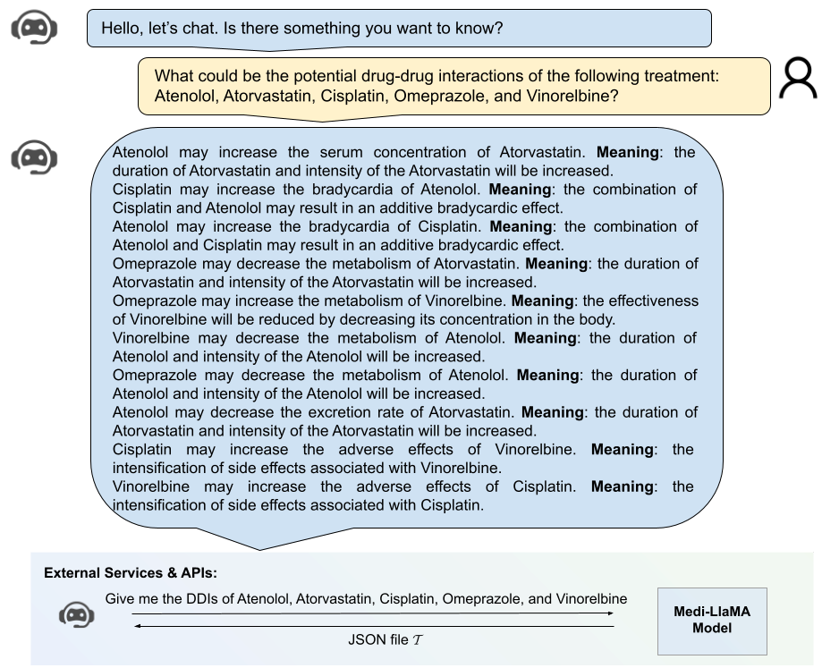

# Medi-LlaMA

Medi-LlaMA is a Hybrid AI system integrating LlaMA, knowledge graphs, and symbolic reasoning and learning. Medi-LlaMA aims to identify individual conditions predisposing patients to adverse treatment responses, empowering healthcare practitioners to prioritize safety improvement and contribute to the overarching goal of universal healthcare. Medi-LlaMA will face the following challenges

+  **Complexity of Medical Data:** Medical information is inherently intricate and specialized, posing challenges in accurately processing and extracting relevant information..
+  **Variability in Patient Responses.** Diverse factors such as genetics, age, overall health, and existing medical conditions contribute to varied patient responses to medications.
+  **Incomplete Information.** Medical databases often lack comprehensive details on side effects and outcomes, particularly for newly introduced medications.
+  **Dynamic Nature of Medical Knowledge.** The continuous evolution of medical knowledge necessitates staying abreast of the latest research findings and updates to ensure the accuracy of the system.
+  **Natural Language Processing.** Processing natural language, especially in the medical domain, is intricate due to nuances, context, and ambiguity, making it challenging to build algorithms for accurate information extraction.
+  **Privacy and Security Concerns.** Accessing patient data, even in anonymized form, raises legitimate privacy and security concerns. Striking a balance between extracting valuable insights and respecting patient confidentiality remains a constant challenge.
+  **Regulatory Compliance.** Medical information is subject to stringent regulations, adding complexity to the development and deployment of systems for summarizing side effects and outcomes while ensuring compliance.

  
# Related Large Language Models (LLMs)

[ChatDoctor](https://github.com/Kent0n-Li/ChatDoctor): A Medical Chat Model Fine-Tuned on a Large Language Model Meta-AI (LLaMA) Using Medical Domain Knowledge.

[medAlpaca](https://github.com/kbressem/medAlpaca): expands upon both [Stanford Alpaca](https://github.com/tatsu-lab/stanford_alpaca) and 
[AlpacaLoRA](https://github.com/tloen/alpaca-lora) to offer an advanced suite of large language 
models specifically fine-tuned for medical question-answering and dialogue applications.

[GPT-4](https://openai.com/research/gpt-4): is a large multimodal model (accepting image and text inputs, emitting text outputs) that, while less capable than humans in many real-world scenarios, exhibits human-level performance on various professional and academic benchmarks.

The accompanying figure illustrates that ChatDoctor successfully identifies four drug-drug interactions related to the medications specified in the input prompt. In contrast, medAlpaca does not offer any specific interaction information for these drugs. GPT-4 demonstrates the capability to provide a comprehensive list of possible drug-drug interactions. Nonetheless, it's important to note that not all of the provided data is accurate. For instance, while Omeprazole is known to potentially increase the metabolism of Vinorelbine, GPT-4 incorrectly indicates that there is no significant interaction between these two drugs.

# Medi-LlaMA- Our Proposed Approach 
We propose a domain-agnostic approach that can empower the predictive capacity of sub-symbolic systems with a deductive database system.
The approach retrieves the DDIs in the input treatment from the Medi-LlaMA Knowledge Graph (Medi-LlaMA KG). Next, the Deductive System (DS) is called, where the DDIs extracted from the Medi-LlaMA KG are part of the Extensional Database (EDB). The Intensional Database (IDB) of the DS comprises a set of rules to deduce new DDIs in treatments. A DDI is deduced when a set of drugs are taken together and is represented as a relation in the minimal model of the deductive database DS.

# The Medi-LlaMA Architecture
Medi-LlaMA is a Hybrid AI System that integrates knowledge graphs, and symbolic and LlaMA models.
+  **Named Entity Recognition** relies on LlaMA; annotated clinical data is utilized for prompt engineering.
+  **The Medi-LlaMA Knowledge Graph (KG)** integrates medical entities extracted from clinical data (i.e., clinical records, scientific publications, clinical trials, and biomedical databases).
+  **LlaMA Fine Tuning** is performed by traversing the Medi-LlaMA KG and the facts uncovered by symbolic reasoning and learning.
+  **Hybrid Prompt Answering** integrates facts collected from the Medi-LlaMA KG, symbolic reasoning and learning, and the Medi-LlaMA model. The Medi-LlaMA system relies on a model selection process to decide which of these subsystems should be called. New facts uncovered by Medi-LlaMA model are materialized in the Medi-LlaMA KG; it can be edited and curated. 

  

# The Medi-LlaMA Timeline
The Medi-LlaMA project is planned to be developed in two years. The plan is two cycles:
+  **Year 1**: Data collection, model training, and LlaMA evaluation
+  **Year 2** Based on results of previous year.
There is an overlap between the last quarter of year 1, and first quarter the year 2.

  

# The Medi-LlaMA Evaluation
Medi-LlaMA will be tested in:
+  Pilot programs in hospitals across Spain, Germany, and South America.
+  Medi-LlaMA will minimize health costs, while maximizing quality of life.
+  Medi-LlaMA will reduce the number of visits to the emergency rooms and hospitalizations caused by adverse events.

# The Medi-LlaMA Team 
**Leibniz University of Hannover (LUH), Germany** ([Scientific Data Management group at LUH](https://www.idas.uni-hannover.de/de/sdm))
+  Dr. Ahmad Sakor 
+ [Dr. Ariam Rivas](https://www.tib.eu/de/forschung-entwicklung/forschungsgruppen-und-labs/scientific-data-management/mitarbeiterinnen-und-mitarbeiter/ariam-rivas)
+ [Dr. Sahar Vahdati](https://nimi-ai.com/sahar-vahdati/)
+ [Prof. Dr. Maria-Esther Vidal](https://www.tib.eu/de/forschung-entwicklung/forschungsgruppen-und-labs/scientific-data-management/mitarbeiterinnen-und-mitarbeiter/maria-esther-vidal)
   
**Universidad Politécnica de Madrid (UPM), Spain** ([Medal team at UPM](https://medal.ctb.upm.es/))
+ [Prof. Ernestina Menasalvas](https://medal.ctb.upm.es/team/ernestina-menasalvas/)
+ [Prof. Victor Robles](https://medal.ctb.upm.es/team/victor-robles-forcada/)
+ [Prof. Alejandro Rodriguez](https://medal.ctb.upm.es/team/alejandro-rodriguez/)
   
**Ramón y Cajal Institute of Health Research (IRYCIS), Spain** ([IRYCIS](https://eatris.eu/institutes/instituto-ramon-y-cajal-irycis/)) 
+ [Prof. Miguel Angel Sicilia](https://scholar.google.com/citations?user=mspPvXQAAAAJ&hl=es&oi=ao)
+ [Prof. Elena García Barriocanal](https://scholar.google.com/citations?user=_VcyznEAAAAJ&hl=es&oi=ao)

**Universidad del Valle, Colombia** ([UniValle](https://www.univalle.edu.co/)) 
+ [Dr. Oswaldo Solarte](https://scholar.google.com/citations?user=WkMMvTAAAAAJ&hl=es&oi=ao)  
