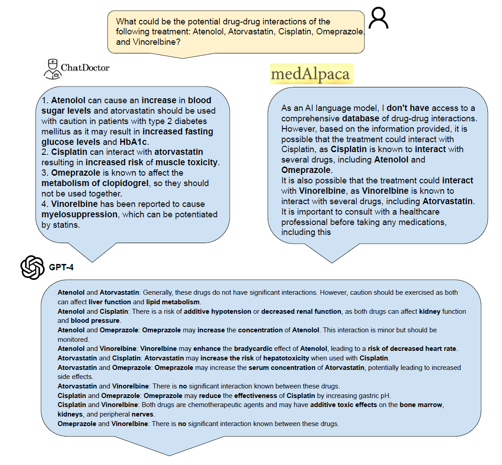

# Medi-LlaMA

A Hybrid AI system that integrates LlaMA, knowledge graphs, and symbolic reasoning and learning. This innovative system aims to identify individual conditions predisposing patients to adverse treatment responses, empowering healthcare practitioners to prioritize safety improvement and contribute to the overarching goal of universal healthcare.

# Existing Approaches

[ChatDoctor](https://github.com/Kent0n-Li/ChatDoctor): A Medical Chat Model Fine-Tuned on a Large Language Model Meta-AI (LLaMA) Using Medical Domain Knowledge.

[medAlpaca](https://github.com/kbressem/medAlpaca): expands upon both [Stanford Alpaca](https://github.com/tatsu-lab/stanford_alpaca) and 
[AlpacaLoRA](https://github.com/tloen/alpaca-lora) to offer an advanced suite of large language 
models specifically fine-tuned for medical question-answering and dialogue applications.

[GPT-4](https://openai.com/research/gpt-4): is a large multimodal model (accepting image and text inputs, emitting text outputs) that, while less capable than humans in many real-world scenarios, exhibits human-level performance on various professional and academic benchmarks.

The accompanying figure illustrates that ChatDoctor successfully identifies four drug-drug interactions related to the medications specified in the input prompt. In contrast, medAlpaca does not offer any specific interaction information for these drugs. GPT-4 demonstrates the capability to provide a comprehensive list of possible drug-drug interactions. Nonetheless, it's important to note that not all of the provided data is accurate. For instance, while Omeprazole is known to potentially increase the metabolism of Vinorelbine, GPT-4 incorrectly indicates that there is no significant interaction between these two drugs.

# Proposed Approach
We propose a domain-agnostic approach that can empower the predictive capacity of sub-symbolic systems with a deductive database system.
The approach retrieves the DDIs in the input treatment from the Medical Knowledge Graph (MedKG). Next, the Deductive System (DS) is called, where the DDIs extracted from the KG are part of the Extensional Database (EDB). The Intensional Database (IDB) of the DS comprises a set of rules to deduce new DDIs in treatments. A DDI is deduced when a set of drugs are taken together and is represented as a relation in the minimal model of the deductive database DS.

 
